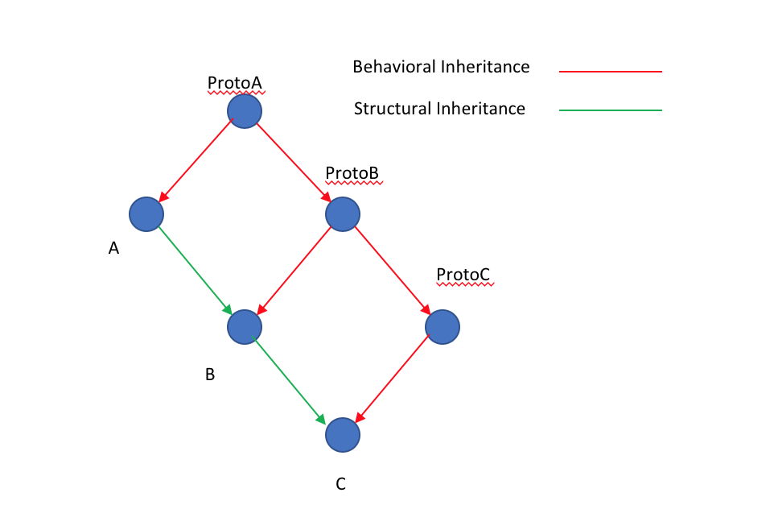

# StructuralInheritance.jl
pseudo structural inheritance for the Julia language


## Example
```Julia
using StructuralInheritance

julia> using StructuralInheritance
[ Info: Recompiling stale cache file /Users/prime/.julia/compiled/v1.0/StructuralInheritance/Z6bEM.ji for StructuralInheritance [8444d97c-b5e1-11e8-1bb1-4d91caf0c934]

julia> @protostruct struct A
         fieldFromA::Int
       end
ProtoA

julia> @protostruct struct B <: A
         fieldFromB
       end
ProtoB

julia> @protostruct struct C <: B
         fieldFromC
       end
ProtoC
```

If we take a look at C we can see it inherits structure.

```Julia
help?> C
search: C cp cd Cmd Char csc cot cos cmp cld cis cat Cint Core Cvoid csch cscd coth cotd cosh cosd cosc copy conj chop ceil cbrt Cuint Colon Clong Cchar const ccall catch ctime count cospi

  No documentation found.

  Summary
  ≡≡≡≡≡≡≡≡≡

  struct C <: ProtoC

  Fields
  ≡≡≡≡≡≡≡≡

  fieldFromA :: Int64
  fieldFromB :: Any
  fieldFromC :: Any

  Supertype Hierarchy
  ≡≡≡≡≡≡≡≡≡≡≡≡≡≡≡≡≡≡≡≡≡

  C <: ProtoC <: ProtoB <: ProtoA <: Any
```
functions can be written to take advantage of the inherited structure

```
julia> getFieldA(x::ProtoA) = x.fieldFromA
getFieldA (generic function with 1 method)

julia> getFieldA(C(3,"ok","c's new field"))
3
```



## Note: parametric inheritence is not yet supported
